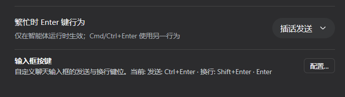
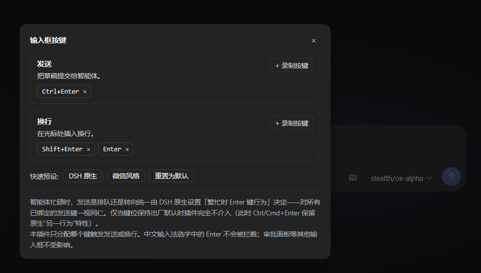

# dsh-composer-keys

> **⚠️ AI 生成声明 / AI-Generated Notice**
> 本项目（代码、文档、测试）由 **AI 助手（DeepSeek Harness 智能体）** 生成，经人工在真实环境中测试验收。
> This project (code, docs, tests) was **generated by an AI assistant** (a DeepSeek Harness agent) and manually verified against a live environment.

<p align="center">
  <strong>把「发送」和「换行」分配给你顺手的键 / Assign send &amp; newline to the keys you like</strong>
</p>

中文 | [English below](#english)

`dsh-composer-keys` 是 [DeepSeek Harness](https://github.com/deepseek-ai/deepseek-harness) Web 前端的输入框按键自定义插件：把 **Enter、Ctrl/Cmd+Enter、Shift+Enter 或任意自定义组合键**（如 Ctrl+S、Alt+Enter）自由分配给「发送」或「换行」两个动作。

**默认保持 DSH 原生行为**——装上插件后一切照旧，只有你主动改绑才会变化。

## 效果图





## 特性

- **自由分配**：「发送」「换行」各自绑定任意一组组合键；同一按键不能同时属于两个动作（录制时自动迁移）。
- **快速预设**：`DSH 原生`（Enter=发送 / Shift+Enter=换行 / Ctrl+Enter=加速提交）与 `微信风格`（Ctrl+Enter=发送 / Enter 或 Shift+Enter=换行）一键切换。
- **两处入口**：Settings → General 的「输入框按键」一行；聊天输入框工具行右侧的小键盘按钮。两者打开同一个配置面板。
- **持久化**：键位存入 DSH 用户设置文档的 `composer-keys` 命名空间——与主题、语言等原生偏好同一条通道，重启保留、跨设备跟随用户文档。
- **深浅色自适应**：面板样式全部引用 DSH 官方语义 token，随主题自动切换。
- **即时生效**：改绑后无需刷新页面。

## 与原生「繁忙时 Enter 键行为」设置的关系

两层机制正交，互不冲突：

| 层 | 归属 | 管什么 |
| --- | --- | --- |
| 手势 → 动作 | **本插件** | 哪个键触发「发送」、哪个键触发「换行」 |
| 动作 → 忙碌语义 | **DSH 原生** | 智能体忙碌时提交是「排队」还是「转向」（即原生的 busy-Enter 设置） |

具体衔接规则：

1. 命中「发送」的手势会被重放为一个合成的普通 Enter 键事件，由 **DSH 原生的提交管线**完成发送——斜杠菜单仲裁、空草稿防抖、忙碌时的排队/转向判断全部保持原生逻辑；
2. **只要键位偏离出厂默认，所有发送键（含 Ctrl/Cmd+Enter）统一遵循原生设置的「本值」行为**——忙碌时按主设置排队或转向，不再保留 Ctrl/Cmd+Enter 的"另一行为"反向特性；
3. 仅当键位保持出厂默认时，插件完全不介入，一切手势（含 Ctrl/Cmd+Enter 的反向特性）保持纯原生。

一句话总结：**插件决定"哪个键发送"，原生设置决定"忙碌时发送意味着什么"。**

## 安全与边界

- **零干预默认**：键位等于出厂默认时，所有原生手势直接放行，插件对页面没有任何行为影响；一旦改绑（含预设），全部已绑定手势统一接管并按普通 Enter 重放。
- **输入法安全**：中文/日文等 IME 组合输入期间的 Enter（选字）永远不会被拦截。
- **范围最小**：只作用于主聊天输入框（依赖其稳定的 DOM 锚点 `[data-input-scroll]`）；审批面板、会话重命名框等其他输入区域不受影响。无活动会话的首屏（hero 界面）不渲染工具按钮属正常行为。
- **无循环风险**：插件自己重放的合成事件通过 `isTrusted=false` 识别并放行。
- **优雅降级**：settings 或 slots 服务不可用时，键盘引擎仍然工作（仅失去持久化或 UI 入口）。

## 安装

从本地 clone 安装：

```bash
dsh plugin --profile web add /path/to/dsh-composer-keys
```

> Git Bash / MSYS 下请使用正斜杠路径（如 `D:/net/GitHub/dsh-composer-keys`），反斜杠会被转义吞掉。

重启 `dsh web` 后生效。卸载：

```bash
dsh plugin --profile web remove dsh-composer-keys
```

已在 DSH `0.1.1-rc.2`（Node 26, Windows 11, pnpm 11 hoisted profile）上验证。

## 使用

1. 打开 Settings → General 找到「输入框按键」行（或点击输入框右下角的小键盘图标），点「配置…」；
2. 在「发送」或「换行」区块点「+ 录制按键」，然后按下想要的组合键（Esc 取消）；
3. 点击已录制的键位标签上的 × 可移除；清空「发送」的全部键位后只能通过发送按钮发送（面板会提示）；
4. 底部预设一键回到「DSH 原生」或切换「微信风格」。

## 工作原理

- 浏览器半件是手写的 lazy-CJS bundle（`window.__ModuleLoader__.load({id, factory})`），无构建步骤；
- 宿主半件只做一件事：向 Host 设置服务注册 `composer-keys` 命名空间 schema，让浏览器半件的 `ctx.settingsScope.bind()` 可以读写持久化配置（apiproxy 对所有注册命名空间一视同仁地提供给 Web 端）；
- **客户端插件的 inject 契约**：工厂必须返回 `{ apply, inject: ['locale', 'slots', 'settingsScope'] }`——vendored cordis 对未声明服务的属性访问会直接抛 `cannot get property X without inject`，导致整个 entry 引导失败（页面横幅 "Failed to load plugins"）。这是本插件踩过的坑，写在这里给其他插件作者参考；
- 「发送」＝重放合成普通 Enter（见上文两层语义）；「换行」＝`document.execCommand('insertText', '\n')`，经由受控 textarea 的原生编辑事件同步 React 草稿状态（带 native value setter 回退路径）；
- 面板样式仅引用真实存在的 DSH token（`--dsw-alias-bg-layer-*`、`--dsw-alias-border-l*`、`--dsw-alias-label-*`、`--dsw-alias-interactive-bg-hover`、`--dsw-alias-brand-primary`、`--dsw-alias-bg-mask-1`）。

## 已知限制

- DSH 大版本升级若改变输入框 DOM 结构（目前锚点是 `[data-input-scroll]`）或调整语义 token 名，拦截/配色可能失效——失效模式是"插件静默不生效"，不会破坏原生功能；
- 极端自定义主题下对比度可能欠佳（token 兜底为浅色值）。

<a id="english"></a>
## English

A [DeepSeek Harness](https://github.com/deepseek-ai/deepseek-harness) web-composer plugin that assigns **any chord** — Enter, Ctrl/Cmd+Enter, Shift+Enter, or custom ones like Ctrl+S — to the **Send** or **Newline** actions. Ships with native behavior by default; nothing changes until you rebind.

- Two presets: **DSH native** and **Chat style** (Ctrl+Enter sends; Enter/Shift+Enter newline), plus free per-action recording with automatic cross-action migration.
- Bindings persist in the user-settings document (`composer-keys` namespace); two entries into one panel (Settings → General row + composer toolbar keyboard button).
- While busy, queue-vs-steer follows the native "Busy Enter behavior" setting uniformly for every bound send key once bindings deviate from defaults.
- Theme-aware styling via official DSW semantic tokens; zero-intervention while bindings stay pristine; synthetic replays are `isTrusted=false`; IME composition never intercepted.

Install: `dsh plugin --profile web add /path/to/dsh-composer-keys`, then restart `dsh web`.

> **AI-generated notice**: this project was generated by an AI assistant and verified manually in a live environment.

## 开发 / Development

```bash
npm test
```

测试用 Node 内置测试运行器直接评估 `client.js` 的真实源码（提取其中的纯手势引擎），无需构建、无第三方依赖。覆盖：手势归一化、绑定解析（含 mod 别名）、动作解析、零干预判定、互斥迁移、脏数据清洗、显示格式化。

## License

[MIT](LICENSE)
